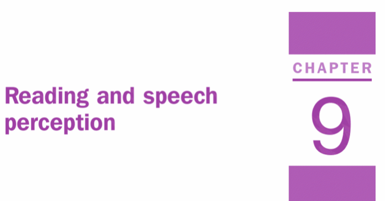
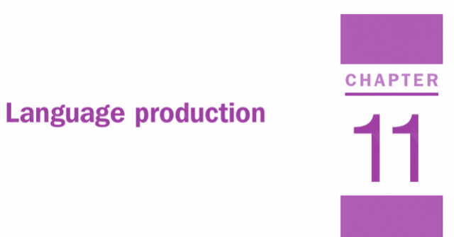
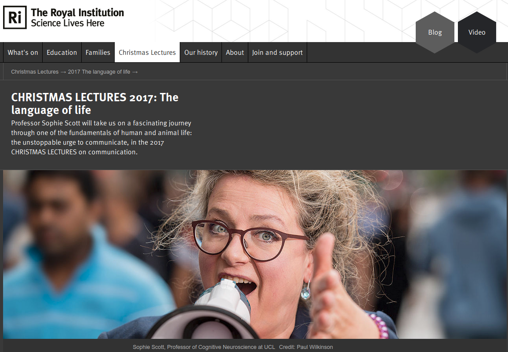

# Overview

Welcome to this second lecture on Language. As with the rest of the lectures in this unit, the material is supported by the Eyesenck and Keane Cognitive Psychology book. The chapters linked to this lecture are Chapter 9 (Reading and Speech Perception) and Chapter 11 (Language Production). You can access the book by clicking on either of the images below.

&nbsp;&nbsp;

[{width=45%}](https://ebookcentral.proquest.com/lib/manchester/reader.action?docID=1974350)
[{width=45%}](https://ebookcentral.proquest.com/lib/manchester/reader.action?docID=1974350)

&nbsp;&nbsp;

As with my previous lecture, this session is made up of a number of videos and links to various resources that I hope you'll find interesting. You can download the full set of slides that I use in these videos in either .pdf or .odp format by clicking on the appropriate link. The videos are recorded in 1080p resolution, so please do watch them in full screen mode. I've recorded the audio using a podcasting microphone and I recommend you listen with headphones.

Download the slides for this lecture in [.pdf format.]
Download the slides for this lecture in [.odp format.]

# Part 1 - Introduction

In this first video, you'll hear information about this lecture and some of the key technical terms that we use in human language processing research.

[video1 - info about this session]

# Part 2 - What is language?

Next we'll talk about what language is and look at an example or two which illustrates why speech percetpion can be so tricky. In the video, I mention work reported in a paper by Altmann and Kamide (1999) which you can access [here](http://psych.colorado.edu/~kimlab/altmann.kamide.1999.pdf).
 
[video2 - what is language?]

# Part 3 - Speech Production

There are several stages involved in producing speech - conceputalisation, formulation, and articulation. Two dominant theories have emerged that try to explain the processes that underlie how these different stages connect with each other. In this video, you will hear about the Weaver++ model of Levelt and colleagues (1999), and about the Spreading Activation model of Dell (1986). 

[video3 - speech production]

# Part 4 - TOTs and Picture/Word Interference

Before watching the video of my slides, have a look at this YouTube video which gives a really nice overview of the Tip-of-the-Tongue (TOT) phenomenon.

&nbsp;&nbsp;

<iframe width="560" height="315" src="https://www.youtube.com/embed/sFeibGnZ6tc" frameborder="0" allow="accelerometer; autoplay; encrypted-media; gyroscope; picture-in-picture" allowfullscreen></iframe>

&nbsp;&nbsp;

[video4 -TOTs and picture/word interference]

# Part 5 - Speech Errors

Speech errors (saying one thing when you mean another) can often reveal important aspects of the language production system. Errors are not random, but rather occur at points in the system that indicate the multi-stage nature of speech production.

[video5 - speech errors]

# Part 6 - Speech Perception

In the next video we'll look at a couple of models of speech perception. The pronunciation of a phoneme by a speaker depends on the preceding and following phonemes. The /b/ phonemes in ‘bill’, ‘ball’, ‘able’, ‘rub’ are acoustically different. This *actually* helps speech perception. Indeed, the use of context and other cues (e.g., non-acoustic information) is important for speech perception. In this video we'll explore two models of speech perception (TRACE and Motor Theory) and the evidence to support them.

Have a look at this great video which includes a demonstration of the McGurk Effect:

&nbsp;&nbsp;

<iframe width="560" height="315" src="https://www.youtube.com/embed/G-lN8vWm3m0" frameborder="0" allow="accelerometer; autoplay; encrypted-media; gyroscope; picture-in-picture" allowfullscreen></iframe>

&nbsp;&nbsp;

# Part 7 - Summary

In this final video, I will summarise the key topics that we covered above.

[video7 - summary]

&nbsp;&nbsp;

## Additional Resources

If you are interested in learning more about language, I recommend you watch The Royal Institution Christmas lecture series on language and communication from 2017 delivered by Sophie Scott (UCL). Just click on the image below to be taken to The Royal Institute page.

&nbsp;&nbsp;

[{width=80%}](https://www.rigb.org/christmas-lectures/2017-the-language-of-life)

&nbsp;&nbsp;

## Technical Details

All of the material in this lecture was created using open source where possible using an [Entroware Apollo laptop](https://www.entroware.com/store/) running [GNU/Linux distro Ubuntu 20.04 LTS (Focal Fossa)](https://releases.ubuntu.com/20.04/). The audio was captured with a [Fifine USB Podcasting microphone](https://www.amazon.co.uk/Condenser-Microphone-Recording-Interface-Power-K669/dp/B01N034RTC/ref=sr_1_1_sspa?crid=141Z8ED4VGCVD&dchild=1&keywords=fifine+usb+podcast+condenser+microphone&qid=1594989611&sprefix=fifne+usb%2Caps%2C162&sr=8-1-spons&psc=1&spLa=ZW5jcnlwdGVkUXVhbGlmaWVyPUFFMzAxOE5DUDJIREwmZW5jcnlwdGVkSWQ9QTA4MzA2NjIxVU40MlhNMFNCTDhWJmVuY3J5cHRlZEFkSWQ9QTA5NDI2OTQxOFY0R002UVJBS1AzJndpZGdldE5hbWU9c3BfYXRmJmFjdGlvbj1jbGlja1JlZGlyZWN0JmRvTm90TG9nQ2xpY2s9dHJ1ZQ==) and the video with a [Razer Kiyo webcam](https://www.amazon.co.uk/Razer-Streaming-Adjustable-Brightness-Microphone/dp/B076QK6489/ref=sr_1_3?dchild=1&keywords=razer+kiyo&qid=1594989677&sr=8-3). The audio and video were recorded using [Open Broadcast Software](https://obsproject.com/) and edited using [Shotcut](https://shotcut.org/). If you interested in learning more about open source software, you might be interested in having a look at [this set of resources](https://ajstewartlang.github.io/24_open_source/knitted_workshop/24_open_source.html) I have put together.

